* Master Build Status 
* Develop Branch Status 
* License 
* Release 

12 requirements of 32 have been implemented, which is 37.5%.

| ID | Name                                                                                                                                                     | Met  | Screenshot                                             |
|----|----------------------------------------------------------------------------------------------------------------------------------------------------------|------|--------------------------------------------------------|
| 1  | All the countries in the world organised by largest population to smallest.                                                                              | No   |                                                        |
| 2  | All the countries in a continent organised by largest population to smallest.                                                                            | No   |                                                        |
| 3  | All the countries in a region organised by largest population to smallest.                                                                               | No   |                                                        |
| 4  | The top N populated countries in the world where N is provided by the user.                                                                              | No   |                                                        |
| 5  | The top N populated countries in a continent where N is provided by the user.                                                                            | No   |                                                        |
| 6  | The top N populated countries in a region where N is provided by the user.                                                                               | No   |                                                        |
| 7  | All the cities in the world organised by largest population to smallest.                                                                                 | No   |                                                        |
| 8  | All the cities in a continent organised by largest population to smallest.                                                                               | No   |                                                        |
| 9  | All the cities in a region organised by largest population to smallest.                                                                                  | No   |                                                        |
| 10 | All the cities in a country organised by largest population to smallest.                                                                                 | No   |                                                        |
| 11 | All the cities in a district organised by largest population to smallest.                                                                                | No   |                                                        |
| 12 | The top N populated cities in the world where N is provided by the user.                                                                                 | Yes  | 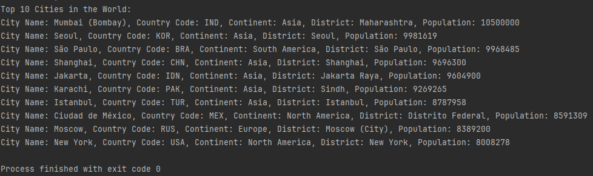           |
| 13 | The top N populated cities in a continent where N is provided by the user.                                                                               | Yes  | 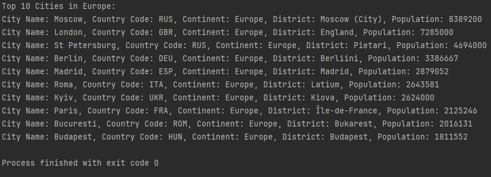           |
| 14 | The top N populated cities in a region where N is provided by the user.                                                                                  | No   |                                                        |
| 15 | The top N populated cities in a country where N is provided by the user.                                                                                 | Yes  | 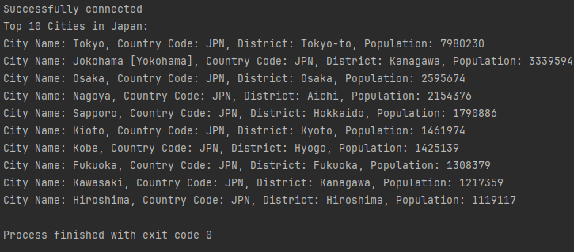           |
| 16 | The top N populated cities in a district where N is provided by the user.                                                                                | No   |                                                        |
| 17 | All the capital cities in the world organised by largest population to smallest.                                                                         | No   |                                                        |
| 18 | All the capital cities in a continent organised by largest population to smallest.                                                                       | Yes  | 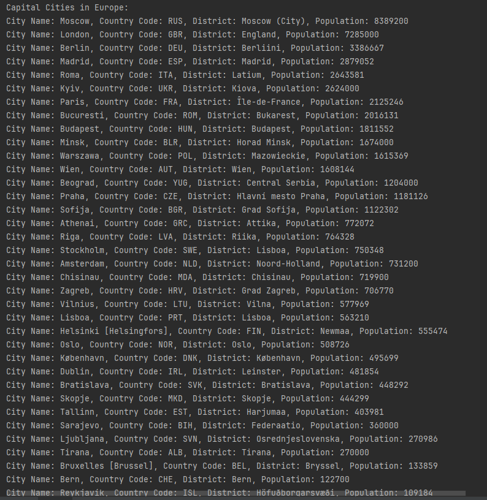        |
| 19 | All the capital cities in a region organised by largest to smallest.                                                                                     | No   |                                                        |
| 20 | The top N populated capital cities in the world where N is provided by the user.                                                                         | Yes  | 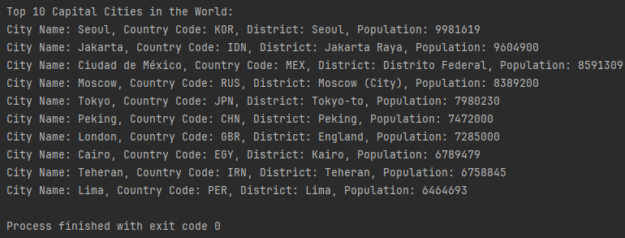    |
| 21 | The top N populated capital cities in a continent where N is provided by the user.                                                                       | Yes  | 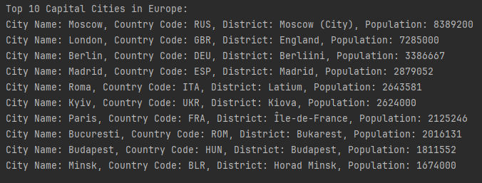   |
| 22 | The top N populated capital cities in a region where N is provided by the user.                                                                          | No   |                                                        |
| 23 | The population of people, people living in cities, and people not living in cities in each continent.                                                    | No   |                                                        |
| 24 | The population of people, people living in cities, and people not living in cities in each region.                                                       | No   |                                                        |
| 25 | The population of people, people living in cities, and people not living in cities in each country.                                                      | No   |                                                        |
| 26 | The population of the world.                                                                                                                             | Yes  | 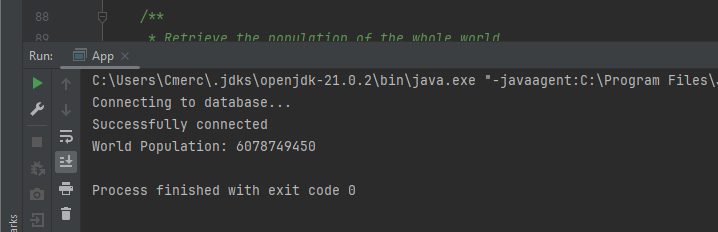              |
| 27 | The population of a continent.                                                                                                                           | Yes  | 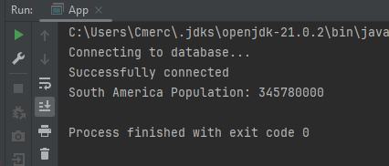       |
| 28 | The population of a region.                                                                                                                              | Yes  | 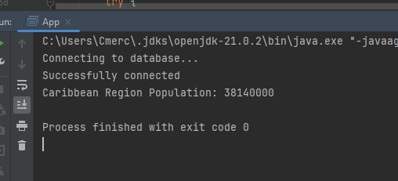    |
| 29 | The population of a country.                                                                                                                             | Yes  | 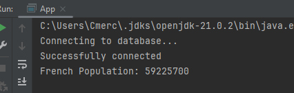      |
| 30 | The population of a district.                                                                                                                            | Yes  | 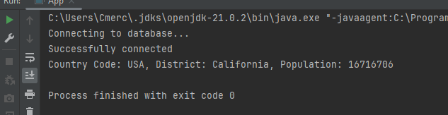 |
| 31 | The population of a city.                                                                                                                                | Yes  | 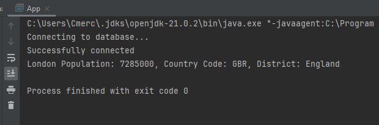         |
| 32 | The number of people who speak the following the following languages from greatest number to smallest, including the percentage of the world population. | No   |                                                        |

* Code Review 1
    - [ ] GitHub project for coursework set-up.
    - [ ] Product Backlog created.
    - [ ] Project builds to self-contained JAR with Maven.
    - [ ] Dockerfile for project set-up and works.
    - [ ] GitHub Actions for project set-up and build is working using JAR, and Docker on GitHub Actions.
    - [ ] Correct branches for GitFlow workflow created - includes master, develop, and release branches.
    - [ ] First release created on GitHub.
    - [ ] Code of Conduct defined.
    - [ ] Issues being used on GitHub.
    - [ ] Tasks defined as user stories.
    - [ ] Full use cases defined.
    - [ ] Use case diagram created.

* Code Review 2
    - [ ] Project integrated with Zube.io.
    - [ ] Kanban/Project Board being used.
    - [ ] Sprint Boards being used.
    - [ ] Suitable unit tests defined.
    - [ ] Tests running on GitHub Actions.

* Code Review 3
    - [ ] Suitable integration tests defined.
    - [ ] Tests running on GitHub Actions.
    - [ ] Deployment working.
    - [ ] Bug reporting system set-up.

* Submission
    - [ ] Metrics from GitHub. Also used to assess individual contribution.
    - [ ] Code quality including comments.
    - [ ] Correct usage of branches.
    - [ ] Continuous integration working.
    - [ ] Kanban/Project Board being used.
    - [ ] Quality and coverage of unit tests.
    - [ ] Project requirements met.

